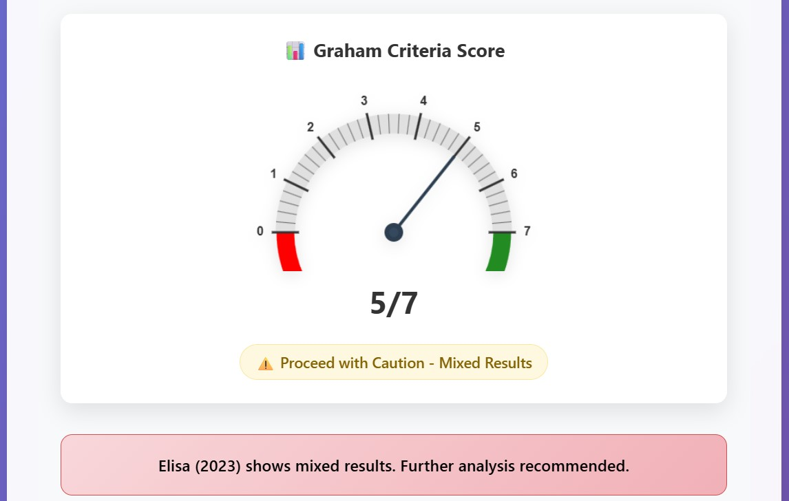

<!-- Logo (centered) -->
<p align="center">
  
</p>

<!-- Title (centered) -->
<h1 align="center">Graham Defensive Investor Analyzer</h1>

<!-- Optional tagline (centered) -->
<p align="center">
  <em>Screen, score, and sanity-check stocks using Graham’s Defensive Investor rules.</em>
</p>

<!-- Overview image (centered with controlled size) -->
<p align="center">
  
</p>

## Overview

**Graham Defensive Investor Analyzer** is a full‑stack web application that allows you to upload a company’s annual report and receive a concise investment recommendation based on Benjamin Graham’s defensive investor criteria.  
At its core the system ingests PDF financial reports, extracts key metrics using a combination of large‑language‑model (LLM) extraction and rule‑based parsing, optionally scrapes missing data from the web, and then evaluates the seven Graham criteria (e.g. revenue size, current ratio, earnings stability, dividend record, earnings growth, price‑to‑earnings ratio and price‑to‑book ratio).  

The application consists of:
* **FastAPI backend** for handling PDF uploads, orchestrating extraction pipelines and serving results.
* **LLM and rule‑based extractors** to parse financial statements, detect company names/years and harvest data from tables.
* **Web scraping modules** to retrieve missing financial data when PDFs lack certain figures.
* **Interactive frontend** built with HTML, CSS and JavaScript that provides an upload form, a dynamic results dashboard and a standalone manual calculator.
* **Manual calculator** page where users can enter financial values themselves and instantly see which criteria pass or fail.

## Technology Stack


This repository brings together the backend Python modules, frontend assets and documentation necessary to run the application locally and understand its architecture.

## Interface Previews

Below are example views of the web application to give you a feel for the user experience.  Each image illustrates a different stage of the workflow.

### Landing Page


The landing page greets the user with a simple upload area and a large **Analyze PDF** button.  From here you can either upload an annual report or open the manual calculator.

### File Upload & Processing


After selecting a PDF, the interface shows the file name and a progress indicator while the system extracts text and detects the company information.

### Partial Analysis Results


Once processing completes, the dashboard displays each criterion’s status.  In this example only five of the seven criteria could be evaluated, resulting in a cautionary score.

### Full Analysis Results



A perfect score occurs when the uploaded report meets all of Graham’s defensive investor criteria.  The gauge turns fully green and the recommendation notes that the company is likely a sustainable investment.

### Extracted Financial Page

 

When the analyzer identifies useful tables in the PDF it also exposes the raw pages for review.  This example shows the key indicators table from the Elisa 2023 financial statement, including revenue, EBITDA, balance sheet metrics and formulas used to derive ratios.

### Manual Calculator Input


The manual calculator allows users to input financial figures manually (annual sales, current ratio, long‑term debt, EPS history and growth, dividend history, price ratios).  It performs real‑time calculations and indicates pass/fail for each of the seven criteria.

### Manual Calculator Results (Examples)


These screenshots demonstrate how the manual calculator presents results—either a mix of pass/fail statuses or a full set of passes depending on the inputs provided.
 
## Architecture and Data Flow

The Graham Analyzer follows a multi‑stage processing pipeline to extract financial information and evaluate investment criteria.  


At a high level the workflow is:

1. **PDF upload & company detection** – The FastAPI backend accepts an annual report PDF and detects the company name and reporting year.
2. **Text extraction** – The `text_extraction.py` module uses `pdfplumber` to extract text and tables from the PDF.
3. **LLM extraction** – An optional LLM‑powered module (`llm_extractor.py`) analyzes the extracted text to identify balance sheets, income statements and cash‑flow sections and to pick out key financial numbers.
4. **Rule‑based extraction** – When LLMs are unavailable or to cross‑check results, `rule_based_extractor.py` uses regular expressions and heuristics to pull figures like revenue, current assets/liabilities and EPS.
5. **Advanced table extraction** – Complex tables are parsed using `advanced_table_extractor.py` which leverages Camelot/Tabula when installed.
6. **Data integration** – The `data_integrator.py` module merges outputs from the LLM, rule‑based and advanced extractors, resolves conflicts and validates currency and scale.
7. **Web scraping fallback** – If certain metrics (e.g. ten‑year EPS history) are missing from the PDF, dedicated scrapers (`scraping_criterion_*`) search trusted financial websites to fetch the required data.
8. **Graham criteria calculation** – The `graham_calculator.py` and `_graham_cal_2.py` modules evaluate each of the seven criteria and compute an overall pass/fail score.
9. **Results presentation** – The frontend renders a gauge showing the number of criteria met and displays pass/fail badges for each criterion.  Users can also open a standalone manual calculator to input their own numbers.

This layered approach ensures resilient extraction: if the PDF does not contain a piece of information, the system either infers it via LLMs or retrieves it from the web, providing a comprehensive and reliable investment analysis.

## Project File Structure

Below is a high‑level view of the key files and directories captured in the original project folder (extracted from a screenshot).  
The table lists each item and its type so you can quickly locate the corresponding module or asset.  Long explanations are provided in the subsequent sections.

| File/Folder                         | Type            | Description/Size                           |
|-------------------------------------|-----------------|--------------------------------------------|
| `_graham_cal_2.py`                  | Python module   | Alt. Graham calculator (90 KB)             |
| `scraping_criterion_7.py`           | Python module   | P/B ratio scraping (10 KB)                 |
| `script.js`                         | JavaScript file | Frontend gauge logic (55 KB)               |
| `style.css`                         | CSS file        | Main stylesheet (18 KB)                    |
| `text_extraction.py`                | Python module   | PDF text extraction engine (11 KB)         |
| `utils.py`                          | Python module   | Utility helpers (2 KB)                     |
| `advanced_table_extractor.py`       | Python module   | Table extraction with Camelot/Tabula (50 KB)|
| `app.py`                            | Python module   | FastAPI server (34 KB)                     |
| `company_year_detector.py`          | Python module   | Company & year detection (11 KB)           |
| `data_integrator.py`                | Python module   | Data integration & conflict resolution (9 KB)|
| `excel_json_reader.py`              | Python module   | Excel/JSON reader (41 KB)                  |
| `graham_calculator.py`              | Python module   | Graham criteria calculator (72 KB)         |
| `graham_criteria.json`              | JSON file       | Criteria configuration                     |
| `graham-calculator-logic.js`        | JavaScript file | Manual calculator logic (27 KB)            |
| `graham-calculator-styles.css`      | CSS file        | Manual calculator styles (14 KB)           |
| `graham-criteria-calculator.html`   | HTML page       | Manual calculator UI (17 KB)               |
| `index.html`                        | HTML page       | Main interface (5 KB)                      |
| `llm_extractor.py`                  | Python module   | LLM‑powered data extraction (25 KB)        |
| `logo_final.png`                    | Image asset     | Application logo (262 KB)                  |
| `processing_pipeline.py`            | Python module   | Processing pipeline orchestrator (23 KB)   |
| `requirements.txt`                  | Text document   | Dependency list (3 KB)                     |
| `rule_based_extractor.py`           | Python module   | Multilingual rule‑based extractor (18 KB)  |
| `scraping_criterion_1_NEW.py`       | Python module   | Web scraping for Criterion 1 (32 KB)       |
| `scraping_criterion_2.py`           | Python module   | Web scraping for Criterion 2 (18 KB)       |
| `scraping_criterion_3_NEW.py`       | Python module   | Web scraping for Criterion 3 (27 KB)       |
| `scraping_criterion_4.py`           | Python module   | Web scraping for Criterion 4 (26 KB)       |
| `scraping_criterion_5.py`           | Python module   | Web scraping for Criterion 5 (15 KB)       |
| `scraping_criterion_6.py`           | Python module   | Web scraping for Criterion 6 (21 KB)       |
| `scraping_criterion_7.py`           | Python module   | Web scraping for Criterion 7 (10 KB)       |
| `Presentation and documentation/`   | Folder          | Project documentation                      |
| `Data_pdf/`                         | Folder          | Sample PDFs                               |
| `Logo/`                             | Folder          | Branding assets                            |
| `__pycache__/`                      | Folder          | Python bytecode cache                      |
| `uploads/`                          | Folder          | Temporary PDF uploads                      |
| `temp/`                             | Folder          | Analysis & intermediate storage            |


## Installation

To run the application locally you need Python 3.10+ and `pip`.  Install the required packages using the provided `requirements.txt`.  Optional dependencies such as Camelot, Tabula, Transformers and Torch enable advanced table extraction and LLM features.  If these libraries are not installed the corresponding modules gracefully fall back to simpler logic.

```bash
# create and activate a virtual environment (optional)
python -m venv venv
source venv/bin/activate

# install core dependencies
pip install -r requirements.txt

# (optional) install advanced extraction and LLM capabilities
# pip install camelot-py[cv] tabula-py torch transformers sentence-transformers
```

## Running the Server

After installing the dependencies, launch the FastAPI server from the project root:

```bash
python app.py
```

By default the backend listens on [http://localhost:8000](http://localhost:8000).  Navigate to that URL in your browser to open the web interface.  You can then upload a PDF and receive a pass/fail summary, or click the **Manual Calculator** button to enter values yourself.

## Contributing

This repository contains a faithfully reconstructed subset of the original Graham Analyzer project.  If you wish to extend or modify it, please follow these guidelines:

1. Fork this repository on GitHub and clone your fork locally.
2. Create a new branch for each feature or bug fix (`git checkout -b my-feature`).
3. Make your changes and commit them with descriptive messages.  Avoid combining unrelated changes into a single commit.
4. Open a pull request describing what you changed and why.  Include screenshots or logs if appropriate.


## Graham Criteria Explained

For convenience, here is a quick reminder of the seven defensive investor criteria defined by Benjamin Graham and implemented in this project:

1. **Adequate Size (Criterion 1)** – Companies should have sufficiently large sales (e.g., > €250 M) to avoid the risks associated with tiny firms.
2. **Strong Financial Condition (Criterion 2A and 2B)** – The current ratio (current assets ÷ current liabilities) should be at least 2 and long‑term debt should not exceed current assets.
3. **Earnings Stability (Criterion 3)** – Positive earnings per share (EPS) in each of the past ten years.
4. **Dividend Record (Criterion 4)** – Uninterrupted dividend payments for at least 20 years.
5. **Earnings Growth (Criterion 5)** – A minimum increase (e.g., one‑third) in per‑share earnings over the past ten years.
6. **Moderate Price/Earnings (P/E) Ratio (Criterion 6)** – The current stock price should not exceed 15 × average earnings of the past three years.
7. **Moderate Price/Book Ratio (Criterion 7)** – The current stock price should not exceed 1.5 × book value per share, and the product of P/E and P/B should not exceed 22.5.

The analyzer automatically computes these ratios and displays a green “Pass” or red “Fail” badge for each.

## License

This project is provided for educational purposes and does not include a formal license from the original author.  Use it at your own discretion and verify any investment advice independently.

## Authors
1. **Md. Abdullah-Al Mamun**
2. **Mst. Nazneen Aktar**


